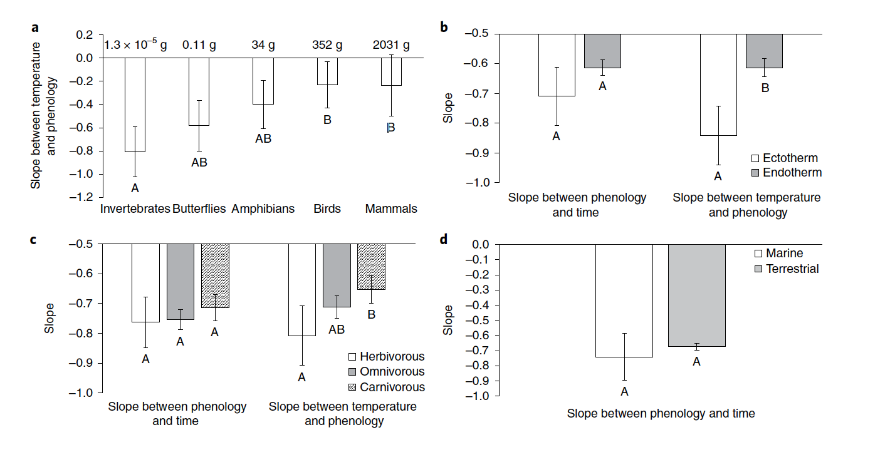

```{r setup, include=FALSE}
knitr::opts_chunk$set(echo = FALSE)
library(tidyverse)
library(magrittr)
library(ggplot2)
```

# Introducing dataset

For this example we will work with the data that was gathered from multiple previously published studies.   
Q: how does temperature affects phenology (e.g. egg laying date) in birds?    
Phenology is timing of recurring biological events, such as reproduction and migration. Examples of phenological traits are: day of egg laying in birds, rut day in ungulates, day of return of migrants and the median day the butterflies are on the wings. There is growing evidence in the literature that phenological events are advancing to earlier dates across the species in the recent decades, due to warming temperatures.
<p style="text-align:center;">

</p>
<p style = "font-size: 70%;text-align:center;">Cohen et al. Nat Clim Change 2018</p>

We have assembled a dataset to assess how temperature affects egg laying in birds globally. 
In the assembled dataset we have 25 studies on 7 bird species from 12 countries.    
This is a subset of the original dataset that actually includes 155 studies on 74 species, from 25 countries.

# Getting to know the data
```{r read-data, echo = TRUE}
dat <- read.csv(file = here::here('data', 'dat_phen_temp_subs.csv'))
head(dat)
str(dat)
```


# Data preparation
We have to convert character variables to factors    
Also, the study ID should be a factor, even if its values are numeric here (pay attention: they are not consecutive, it is a subset of a larger dataset)

```{r data prep, echo = TRUE, fig.align='center'}
dat_fac <- dat %>%
  mutate_if(is.character, as.factor) %>% 
  mutate(ID = as.factor(ID))
str(dat_fac)

## pay attention to the number of studies, number of species and number of countries, from which they are coming
levels(dat_fac$Species)

hist(dat_fac$det_Clim, xlab = 'Standardized temperature', main = NULL)
hist(dat_fac$Trait_mean, xlab = 'Standardized phenological trait', main = NULL)

```

# Relation between temperature and phenology

```{r explore relation, echo = TRUE, fig.align='center'}
ggplot(dat_fac, aes(x = det_Clim, y = Trait_mean)) +
  geom_point() + theme_bw() + 
  xlab('Standardized temperature') +
  ylab('Standardized phenology')

```

# Let us have a loook at this relation per species

```{r relation per species, echo = TRUE, out.width= '100%', fig.align='center'}
ggplot(dat_fac, aes(x = det_Clim, y = Trait_mean)) +
  geom_point() + theme_bw() + 
  facet_wrap(vars(Species)) +
  xlab('Standardized temperature') +
  ylab('Standardized phenology')

```

We have more data points for some species than for the others because some species were observed in several locations, so there are multiple studies from different locations for the same species.   
Let us have a look at the relation per study ID.

```{r relation per study ID, echo = TRUE, out.width= '100%', fig.align='center'}
ggplot(dat_fac, aes(x = det_Clim, y = Trait_mean)) +
  geom_point() + theme_bw() + 
  facet_wrap(vars(ID)) +
  xlab('Standardized temperature') +
  ylab('Standardized phenology')

table(dat_fac$Species, dat_fac$ID)
table(dat_fac$Species, dat_fac$Location)
```


# Fit a model with all data together
```{r mod-all data, echo= TRUE, out.width= '100%', fig.align='center'}
modAll <- lm(Trait_mean ~ det_Clim, data = dat_fac)
summary(modAll)
par(mfrow = c(2,2), mar = c(4, 4, 2, 1))
plot(modAll)

```

## Interpreting the diagnostics plots
- Residuals vs Fitted can show indications of non-linear relations between the predictors and response variables. If there is a clear pattern visible in the scatter of residuals vs fitted values, it means we did not grasp the non-linear relation. If the residulas are more-less equally spread around the horizontal line - the fitted relation is appropriate.  
- Normal Q-Q plot: plots the sample residual quantiles vs their theoretical quantiles. <span style="color:orange"> What is a quantile???</span> So, if the points fall on 1:1 line, it means that the residuals are perfectly normally distributed. Remember: normally, to test the linearity assumption, one has to check for normality of residuals at *each* predictor value!    
- Scale-Location plot, is also called Spread-Location plot. It tests the asumption of homoscedasticity, i.e. equal variance across the values of the predictor. It shows the residuals along the ranges of predictors. If the red line is approximately horizontal with equally (randomly) spread data points, then the data satisfy the assumption of homoscedasticity. Here the square root of absolute residulas is used on y axis, as it diminishes the skewness.     
- Residuals vs Leverage: allows finding influential points. Influential points (not always outliers!) are those that would change drastically the fit of the model if we excluded them from the analyses (i.e. the fitted trend would look different). Here we do not pay attention to the pattern in the plot. We look whether there are data points that have both high leverage and large magnitude (positive or negative) of residuals, i.e. points that fall in lower right or upper tright corners of the plot. Those points usually lay outside of Cook's distance, shown in red dashed lines.

It is also useful to see how residuals are distributed against each of your predictors.
```{r residPred, echo= TRUE, out.width= '100%', fig.align='center'}
dat_fac$Res_lm <- resid(modAll)
ggplot(dat_fac, aes(x = det_Clim, y = Res_lm)) +
  geom_point() +
  geom_smooth(method = 'loess', se = FALSE)  +
  theme_bw() + xlab('Standardised temperature') +
  ylab('Residuals')

```

If we see a strong non-linear pattern in this diagnostics plot, the linearity assumption was not met. 

__Attention: model diagnostics plot is not an absolute test of the model assumptions. The model diagnostics may look all fine, even if some of the model assumptions are violated!!!!__

<span style="color:blue"> In our case, data points per each species are not independent, i.e. there is a structure in the data imposed by species </span> 

## Interpreting the model output
$y = \alpha + \beta\times x + \epsilon$, $\epsilon \sim N(0, \sigma^2)$    
<span style="color:green">$\alpha$</span> is intercept, i.e. the value of the response variable when the predictor = 0,

<span style = 'color:orange'>$\beta$</span> is slope, i.e. by how much the response variable is increasing 
per each unit of the predictor    
```{r intercept&Slope, out.width= "100%", out.height= "100%", fig.align='center'}
set.seed(5)
npoints <- 20
x <- rnorm(npoints, mean = 0, sd= 2)
y <- 2 + x*3 + rnorm(npoints, 0, 1)
plot(y ~ x, pch = 19, xlab = 'Predictor / Explanatory/',
     ylab = 'Response / dependent', xlim = c(min(x), max(x)))
mtext('independent', side = 1, line = 4)
abline(lm(y ~ x), col = 'blue', lwd = 2)
segments(x0 = 0, y0 = 0, x1 = 0, y1 = 5, col = 'grey', lwd = 2)
segments(x0 = min(x), y0 = coef(lm(y ~ x))[1], x1 = max(x), y1 = coef(lm(y ~ x))[1], col = 'green', lwd = 2)

segments(x0 = 0.3, y0 = coef(lm(y ~ x))[1], x1 = 0.25, y1 = coef(lm(y ~ x))[1] + 0.6, col = 'orange', lwd = 3)


```


``` {r mod output interpret, echo = TRUE, fig.align = 'center'}
summary(modAll)
```
__Intercept:__ the value of phenology (response variable) when the value of temperature (i.e. predictor variable) is 0. In this case the temperature of 0 corresponds to mean temperature as the data are standardized.     
__Slope:__  By how much the phenology changes if we change the temperature by one unit (in this case 1 SE of temperature, since the data are standardized). So, with an increase in temperature by 1 SE the phenology (e.g. egg laying date) declines by 0.54 of temperature SE.     
__Residual Standard Error:__   a measure of the quality of a model fit. The Residual Standard Error is the average amount by which the response will deviate from the true regression line.  Given that the average phenology of all species is ~ 0, the Residual Standard Error of ~0.8 means that the percentage error is 80%. How good is our model???
Important: degrees of freedom are calculated as the number of data points minus the number of estimated parameters. <span style="color:orange"> How many parameters do we estimate in this model? </span>    
__R-squared:__ a measure of how good the model is fitting the data. It shows the proportion of the explained variance in our data, the higher the proportion of the explained variance, the closer is $R^2$ to 1, and as the variance explained in the response variable declines, $R^2$ approaches 0. Our model is explaining the data rather poorly.     
__F statistic__: tests whether there is a relationship between the predictor(s) and the response variable. The larger F, the better. But how large it should be for the model to fit the data well depends on the number of data points. Whether model fits the data well is then shown by the p value associated with this F statistic.


# Consider species explicitly    
## Test for interaction between the species and temperature    

<span style="color:orange"> What is a statistical interaction? What does it mean that species and temperature interact in their effect on phenology? </span>    


### Fit the model with interaction
```{r mod-spInteract, echo= TRUE}
mod_SpInteract <- lm(Trait_mean ~ det_Clim + Species + det_Clim:Species, data = dat_fac)
summary(mod_SpInteract)
```

<span style="color:orange"> Why do we have 736 degrees of freedom? </span>     
<span style="color:orange"> Let us interpret the output. Is interaction significant? </span>

Check model diagnostics
``` {r mod_spInteractd diagnostics, echo = TRUE, out.width = '100%', fig.align = 'center'}
par(mfrow = c(2,2), mar = c(4, 4, 2, 1))
plot(mod_SpInteract)
```

### Fit the model with the additive impact of temperature and species
<span style="color:orange"> What does it mean that species and temperature do not interact, i.e. act additively in their effect on morphology? </span>
```{r mod-spAdd, echo= TRUE}
mod_SpAdd <- lm(Trait_mean ~ det_Clim + Species, data = dat_fac)
summary(mod_SpAdd)

```

## Likelihood-Ratio Test to assess significance
```{r LRT_inter, echo= TRUE}

anova(mod_SpAdd, mod_SpInteract, test = 'Chisq')
```
One cannot rely on the p values output from `lm()` call if one has as predictors factors with >2 levels. To assess whether that factor is significant (or, as in this case, whether an interaction of such a factor with another variable is significant), we usually rely on LRT.    
LRT assesses the goodness of fit of two competing models using the ratio of their likelihoods. It is based on Chi2 statistics.   
__We find a significant interaction between species and temperature. Besides, this model fits the data much better than the one without species (see adjusted R-Squared)__   
Still, even though the fit is much better than that of the model with temperature only as a predictor, this model is still doing not a good job at explaining the variance in the data (Adjusted $R^2$ is `r round(summary(mod_SpInteract)$adj.r.squared, 3)`)

# Plot predictions of this model
```{r pred Mod-spInteract, out.width= '100%', fig.align='center'}
dat_fac$pred <- predict(mod_SpInteract, data = dat_fac)

ggplot(dat_fac, aes(x = det_Clim, y = Trait_mean)) +
  geom_point() + theme_bw() + 
  facet_wrap(vars(ID)) +
  geom_line(data = dat_fac, aes(x = det_Clim, y = pred), col = 'red') +
  xlab('Standardized temperature') +
  ylab('Standardized morphological traits')

ggplot(dat_fac, aes(x = det_Clim, y = Trait_mean)) +
  geom_point() + theme_bw() +
  geom_line(data = dat_fac, aes(x = det_Clim, y = pred, group = ID), col = 'red') +
  xlab('Standardized temperature') +
  ylab('Standardized morphological traits')

```


# Questions?


# References 
- Cohen JM, Lajeunesse MJ & Rohr JR (2018) A global synthesis of animal phenological responses to climate change. _Nature Climate Change_  doi:10.1038/s41558-018-0067-3.   
- Thackeray SJ et al. (2016) Phenological sensitivity to climate across taxa and trophic levels. _Nature_ 535, 241–245.   


