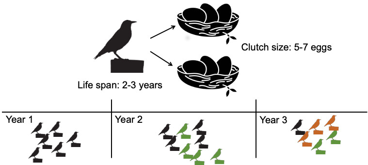
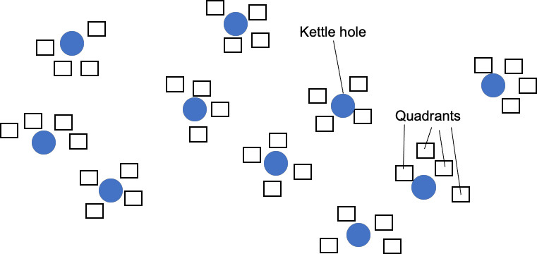
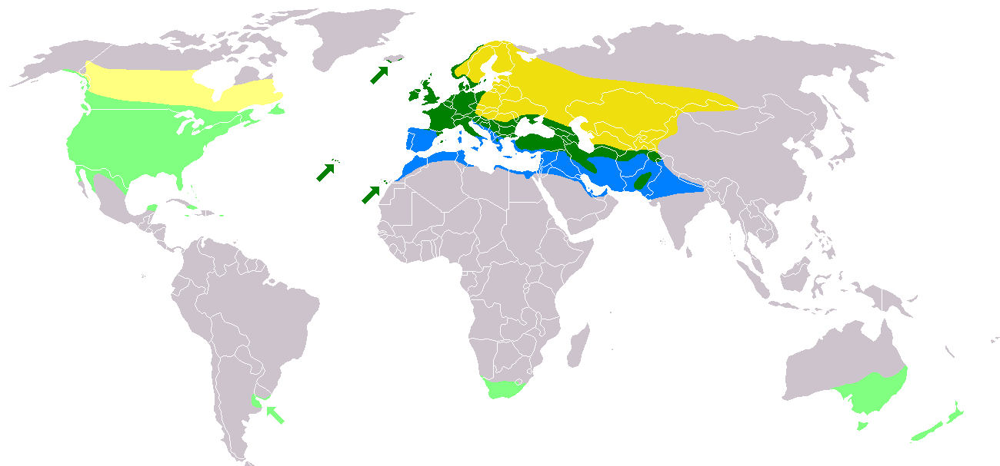

```{css, echo = FALSE}
.reveal ul {
  font-size: 30px;
}
.reveal ol {
  font-size: 30px;
  margin-bottom: -10px;
}
.reveal p {
 font-size: 30px;
  margin-bottom: -10px;
}
.reveal  pre {
  font-size: 14px;
  max-height: 300px;
  overflow-y: auto;
  margin-bottom: -3px;
}
.reveal code.r{
  font-size: 14px;
}

pre[class] {
  max-height: 100px;
}
.reveal .reflist ul{
  font-size: 26px;
}

```


```{r setup, include=FALSE}
knitr::opts_chunk$set(echo = FALSE)
```

# Mixed-effects models

*What is it and when do we need them?*


# Non-independence in data
- multiple observations per individual    
<p style="text-align:center;">

</p>

  Q: How does infection affects the clutch size of common starlings?   
  We record the clutch size for a sample of females, over 3 years. Some females may on average have larger clutches than the others (e.g. because of their better body condition) but we are not interested in these differences.

# Non-independence in data
- data gathered in several plots and samples within same plots are more similar than from different ones
<p style="text-align:center;">

</p>
   
  Q: how does agricultural practice affects plant species richness close to kettle holes?    
  We record plant species richness close to 10 different kettle holes (at each kettle hole we place 4 quadrats/relevees).    
  
# Non-independence in data
<p style="text-align:left;">
  We are not interested in predicting species richness for each specific kettle hole.    
  Rather, we aim to explain the variation in kettle holes associated with some fixed effects, like proximity to agricultural fields.    
  But the SR may be more similar for quadrats from the same compared to different kettle holes    
  Also, SR from the closer located kettle holes may be more similar: non-independent data.    
</p>
  __samples (i.e. individuals or plots) introduce non-independence in the data structure__


# Why such a name? 


* What is mixed???
* it is not about cocktails
* Mixed models are called so because they include two types of effects:   
  + fixed effects & random effects


# Fixed effect

These are the effects we are used to in linear models.
It is assumed that the values of a fixed variable in one study are the same as the values of the fixed variable in another study.

$ClutchSize \sim ParasiteLoad + \epsilon$, $\epsilon \sim N(0, \sigma^2)$

```{r linear model2, out.width= "60%", out.height= "60%"}
npoints <- 20
x <- rnorm(npoints, mean = 0, sd= 2)
y <- 2 + x*3 + rnorm(npoints, 0, 1)
plot(y ~ x, pch = 19, xlab = 'Parasite load',
     ylab = 'Clutch size')
abline(lm(y ~ x), col = 'blue', lty = 2)
```

# Fixed effect

If predictor is a factor, we are typically interested in the effects of all levels of this factor.
For example:   

- Sex (F/M),   
- survival of Unicorns in Germany and France,  
- treatment (polluted / not; predator present / absent)               

  There maybe more levels than those measured (DE & FR) but we are __SPECIFICALLY__
  interested to know the response for only those two levels


# Random effect

"Random effects" are assumed to be values that are drawn from a larger population of values and thus will represent them. 
One can think of the values of random variables as representing a random sample of all possible values or instances of that variable.


# Random effect
- Data has several or many levels of the factor, but we are not interested in predicting to each of those levels     
Q: how does starling weight changes with the latitude?    
We measure weight of starlings in DE, FR, NL, UK, UA, BE, IT, SE, TR, CH.
<p style="text-align:center;">

</p>
We are not interested in what is the weight of the individuals in each specific country, we are interested in average weight of the species across the countries.

# Random effect
- Usually >5 levels to be able to consider as random effect   

  *It does not make sense to estimate a random effect; instead, we estimate the parameters that describe the distribution of this random effect.*

# Decision
- Some decision is required when to use fixed and when to use random effects. It may be somewhat subjective.
Sometimes the choice is clear and obvious, in other cases the views (of statisticians) may differ.

- Obviously fixed effects: Sex, treatment (e.g. polluted /not; infected / not), age.
- Effects that may require some judgement:
  - year (we are in principle not interested in knowing survival in particular years; unless we only measured in two years!)
  - country, location, species.   

# You decide
- Species richness studied close to 3 kettle holes only. Will we treat kettle hole as a fixed or a mixed effect?
- We studied the impact of landscape of fear on two species: rats and voles. Is species to be treated as fixed or mixed effect?
- and if we had looked at 9 rodent species?


# Terminology

may be confusing

You may see such terms:

- Hierarchical linear models
- Variance components
- Random intercepts and slopes
- Random effects
- Random coefficients
- Multilevel models


# Question
- We learned about models with fixed effects only (e.g. a linear model) and models with both random and fixed effects (i.e. mixed-effects models).
- Can there be models with random effect(s) only?

# Questions?


# Literature
::: {.reflist}

- Zuur AF, Ieno EN, Walker N, Saveliev AA, Smith GM (2009) Mixed-Effects Models and Extensions in Ecology with R. New York, Springer New York: XXII, 574 p.   
- Faraway JJ 2006. Extending the Linear Model with R: Generalized Linear, Mixed Effects and Nonparametric Regression Models  Chapman and Hall, New York, 345 p.</span></ul>   

:::


