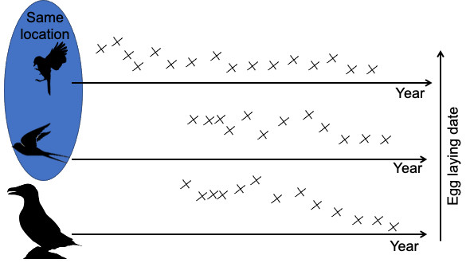

```{css, echo = FALSE}
.reveal ul {
  font-size: 30px;
}
.reveal ol {
  font-size: 30px;
  margin-bottom: -10px;
}
.reveal p {
 font-size: 30px;
  margin-bottom: -10px;
}
.reveal  pre {
  font-size: 14px;
  max-height: 300px;
  overflow-y: auto;
  margin-bottom: -2px;
}
.reveal code.r{
  font-size: 14px;
}

pre[class] {
  max-height: 100px;
}

.scroll-100 {
  max-height: 100px;
  overflow-y: auto;
  background-color: inherit;
}
```


```{r setup, include=FALSE}
knitr::opts_chunk$set(echo = FALSE)
library(tidyverse)
library(ggplot2)
library(lme4)
library(merTools)
```

# Random intercept models

<span style= "color:orange"> What is intercept? </span>   


- $y = \alpha + \beta\times x + \epsilon$, $\epsilon \sim N(0, \sigma^2)$    
- <span style="color:green">$\alpha$</span> is intercept, i.e. the value of the response variable when the predictor = 0,

- <span style = 'color:orange'>$\beta$</span> is slope, i.e. by how much the response variable is increasing 
per each unit of the predictor
```{r interceptReminder, out.width= "40%", out.height= "40%", fig.align='center'}
npoints <- 20
x <- rnorm(npoints, mean = 0, sd= 2)
y <- 2 + x*3 + rnorm(npoints, 0, 1)
plot(y ~ x, pch = 19, xlab = 'Predictor / Explanatory/',
     ylab = 'Response / dependent')
mtext('independent', side = 1, line = 4)
abline(lm(y ~ x), col = 'blue', lwd = 2)
segments(x0 = 0, y0 = 0, x1 = 0, y1 = 5, col = 'grey', lwd = 2)
segments(x0 = min(x), y0 = coef(lm(y ~ x))[1], x1 = max(x), y1 = coef(lm(y ~ x))[1], col = 'green', lwd = 2)

segments(x0 = 0.3, y0 = coef(lm(y ~ x))[1], x1 = 0.25, y1 = coef(lm(y ~ x))[1] + 0.6, col = 'orange', lwd = 3)


```

# Random intercept models: math 

Let us consider a LMM with:    

- one random factor that has $q$ levels,    

- $n$ observations, and     

- $p$ explanatory fixed variables (in $\mathbf{X}$)   

$\mathbf{Y} = \mathbf{X} \beta + \mathbf{Z}b + \epsilon$

These matrices stand for:


<font size = 3>
$$
\begin{bmatrix} y_1 \\ y_2 \\ y_3 \\ \vdots \\ y_n \end{bmatrix} =
\begin{bmatrix}
1 & x_{1,1} & x_{1,2} & \dots & x_{1,p} \\
1 & x_{2,1} & x_{2,2} & \dots & x_{2,p} \\
1 & x_{3,1} & x_{3,2} & \dots & x_{3,p} \\
\vdots & \vdots & \vdots & \ddots & \vdots \\
1 & x_{n,1} & x_{n,2} & \dots & x_{n,p}
\end{bmatrix}
\begin{bmatrix}
\beta_0 \\ \beta_1 \\ \beta_2 \\ \vdots \\ \beta_p
\end{bmatrix}+
\begin{bmatrix}
z_{1,1} & z_{1,2} & z_{1,3} & \dots & z_{1,q} \\
z_{2,1} & z_{2,2} & z_{2,3} & \dots & z_{2,q} \\
z_{3,1} & z_{3,2} & z_{3,3} & \dots & z_{3,q} \\
\vdots & \vdots & \vdots & \ddots & \vdots \\
z_{n,1} & z_{n,2} & z_{n,3} & \dots & z_{n,q} \\
\end{bmatrix}
\begin{bmatrix}
b_1 \\ b_2 \\ b_3 \\ \vdots \\ b_q
\end{bmatrix}+
\begin{bmatrix}
\epsilon_1 \\ \epsilon_2 \\ \epsilon_3 \\ \vdots \\ \epsilon_n
\end{bmatrix}
$$ 
</font>


# Random intercept models: math    

often

<font size = 5>
$b \sim N(0, \mathbf{D})$,
$\epsilon \sim N(0, \mathbf{\sum})$
</font>

Or, in more detail:

<font size = 5>
$$
b \sim N\left(0,
\begin{bmatrix}
\lambda & 0 & 0 & \dots & 0 \\
0 & \lambda & 0 & \dots & 0 \\
0 & 0 & \lambda & \dots & 0 \\
\vdots & \vdots & \vdots & \ddots & \vdots \\
0 & 0 & 0 & \dots & \lambda \\
\end{bmatrix}\right)
\text{&  }
\epsilon \sim N\left(0,
\begin{bmatrix}
\phi & 0 & 0 & \dots & 0 \\
0 & \phi & 0 & \dots & 0 \\
0 & 0 & \phi & \dots & 0 \\
\vdots & \vdots & \vdots & \ddots & \vdots \\
0 & 0 & 0 & \dots & \phi
\end{bmatrix}\right)
$$
</font></center>

where $\lambda$ and $\phi$ are, respectively, variances of a random effect and of residuals.  

In the random intercept model the relations between predictor(s) and the response are the same across all levels of the random effect variable   


# Example
Let us recall the example from the exercise:    
Q: assess the relation between phenology and temperature across species.    

<ul style='text-align: left;'> 
Let us consider an example with:     

- 6 species, i.e. $q = 6$ (the number of levels of the random factors, or number of groups / IDs);    
- 120 datapoints, i.e.  $n = 120$ (we simplify and assume there is 20 data points per each species, but generally it is not required to have same number of observations per level)   
- 1 fixed explanatory continuous variable, i.e. $p = 1$ (temperature)  

</ul>

```{r simu-RIdata}
SimulateMix <- function(intercept, slope, n, group.nb, var.group, var.error, times.perGroup){
  data <- data.frame(intercept = intercept, slope = slope, x = rnorm(n, 0, 2))
  data$group <- factor(rep(paste("group", 1:group.nb, sep = "_"), times.perGroup))
  data$b <- rep(rnorm(group.nb, mean = 0, sd = sqrt(var.group)), times.perGroup)
  data$error <- rnorm(n, mean = 0, sd = sqrt(var.error))
  data$y <- data$intercept + data$slope*data$x + data$b + data$error
  data <- data[order(data$group),]
  return(data)
}


```

# Our simulated data

```{r check simu-data, echo = TRUE}
set.seed(5)
Weight_sim <- SimulateMix(intercept = 0.1, slope = -0.4, n = 120, 
                          group.nb = 6, var.group = 0.1, 
                          var.error = 0.05, times.perGroup = 20)

Weight_sim[c(1:5, 21:25), ]
```
<p style = "font-size: 60%;"> 
We simulated the data assuming 6 species (groups more generally), with 20 data points per species, a negative relation between temperature and weight, and some variation around the random intercept. </p>


# Plot the data 
*predictor, i.e. temperature*

```{r plot simu-data predictor, echo = TRUE, fig.align='center', out.width= "60%", out.height= "60%"}
hist(Weight_sim$x, main = NULL, xlab = 'Standardized temperature')

```

# Plot the data 
*response, i.e. phenology*

```{r plot simu-data response, echo = TRUE, fig.align='center', out.width= "60%", out.height= "60%"}
hist(Weight_sim$y, main = NULL, xlab = 'Standardized phenological trait')

```


# Plot the data
*relation between the predictor and response per level of random effect*

```{r plot simu-data relation, fig.align='center'}
ggplot(Weight_sim, aes(x = x, y = y)) +
  facet_wrap(vars(group)) + geom_point() +
  theme_bw() + xlab('Standardized temperature') +
  ylab('Standardized phenological trait')
```


# Fit the random-intercept model

We will have a look at the syntax of several different R libraries that allow fitting mixed-effects models.    
Let us start with using the `lme4` package and a function `lmer()`.    
We specify the random effect with the syntax ` (1|group)`.   


```{r randomInterc, echo = TRUE}
mod_randi <- lmer(y ~ x + (1|group), data = Weight_sim, REML = FALSE)

```


# Interpreting model output  

```{r mod output2}
summary(mod_randi)
```

- We see information on AIC, BIC, Log Likelihood, df. <span style = 'color:orange'>Why do we have 116 degrees of freedom?</span>   
- __Random effects__ shows the estimated parameters for random effects. The variance of the random intercept $\lambda$ is estimated at $\lambda =  0.3602^2 = 0.1297$    


# Interpreting model output

```{r mod output3}
summary(mod_randi)
```
- __Residual variance__ is estimated at $\phi = 0.2261^2 = 0.0511$     
- __Fixed effects__ shows the estimates of the fixed effects parameters (as well as their SError), just as in the regular linear model.

# Compare estimated and simulated parameters
```{r mod output, echo = TRUE}
c(coef_lmer       <- as.numeric(fixef(mod_randi)[1]), as.numeric(fixef(mod_randi)[2]), 
  var_group_lmer  <- as.numeric(attr(VarCorr(mod_randi)$group, "stddev")^2),
  var_error_lmer  <- as.numeric(attr(VarCorr(mod_randi), "sc")^2))
```
We used 

- intercept = 0.1,   
- slope = -0.4,   
- var.group = 0.1,   
- var.error = 0.05.   
<p style = "font-size: 80%;"> 
- <span style = 'color:orange'>What does `fixef()` does?</span>     
- <span style = 'color:orange'> And what does `ranef()` does?</span>    
</p>

# Fixed-effects estimates: `fixef()` 
<p style = "font-size: 80%;">
`fixef()` extracts the fixed-effects estimates. So, in our case these are the estimates of the intercept and the slope of phenology on temperature. If we had categorical predictor, the estimates would be the difference of each level of that categorical predictor with the one that is taken as reference, i.e. intercept (this is the way R usually fits models)</p>

```{r fixef extr, echo = TRUE}
fixef(mod_randi)
```

# BLUP: `ranef()`
<p style = "font-size: 80%;">`ranef()` returns conditional modes of the random effects. These are also known (in case of linear models) as __Best Linear Unbiased Predictors (BLUPs)__.
They show the difference between the (population-level) average predicted response for a given fixed-effect value and the response predicted for a particular level of the random factor (i.e. individual/group/species). You can think of these as the group-level effects, i.e. how much does any group/species differ from the mean population value?</p>

```{r ranef extr, echo = TRUE}
ranef(mod_randi)
```


# Non-independence of the data
What is the correlation between the observations taken for the same species and for those from different species?
<p style="text-align:center;">

</p>


# Non-independence of the data  

$\mathbf{Y}_{i} = \mathbf{X}_{i} \beta + \mathbf{Z}_{i}b_i + \epsilon_i$    
To derive the expression of the covariance matrix, this can be written as   
$\mathbf{Y} \sim N(\mathbf{X} \beta, \mathbf{V}_{i})$    
where $\mathbf{V_{\mathit{i}}} = \mathbf{Z}_{i} \times \mathbf{D}_{i} \times \mathbf{Z'}_{i} + \mathbf{\sum}_{i}$    
recall that    
$b \sim N(0, \mathbf{D})$,    
$\epsilon \sim N(0, \mathbf{\sum})$    

so, $\mathbf{D}_{i}$ is the covariance matrix of the random effects. That means that including random effects has impact on the covariance matrix $\mathbf{V}_{i}$. 


# Intraclass Correlation Coefficient   

Looking at the covariance matrix for a single species    

$$
\mathbf{V}_{i} = 
\begin{bmatrix}
\lambda + \phi & \lambda & \lambda & \dots & \lambda \\
\lambda & \lambda + \phi & \lambda & \dots & \lambda \\
\lambda & \lambda & \lambda + \phi & \dots & \lambda \\
\vdots & \vdots & \vdots & \ddots & \vdots \\
\lambda & \lambda & \lambda & \dots & \lambda + \phi \\
\end{bmatrix}
$$

This shows that the covariance between any two data points for the same species is $\lambda$ and the variance is $\lambda + \phi$      
By definition, the correlation between two observations coming from the same species is: $\lambda / (\lambda + \phi)$    
This is called **intra-class correlation (ICC)**.   


# Calculate ICC for our example

```{r ICC, echo = TRUE}
summary(mod_randi)
var_group_lmer  <- as.numeric(attr(VarCorr(mod_randi)$group, "stddev")^2)
var_error_lmer  <- as.numeric(attr(VarCorr(mod_randi), "sc")^2)
ICC <- var_group_lmer / (var_group_lmer + var_error_lmer)
```
So, the Intra-class correlation is `r ICC`

# Implications of ICC
<p style='text-align:left;'> 
- Intra-class correlation for our data is `r round(ICC, 2)`     
-  It means that our sample size is not 120 and actually, should be corrected to *effective sample size* ($N_{effective}$)   
To do that, we need the ICC = `r round(ICC, 2)`, and $\mathit{l}$ (number of samples per individual) = 20.     
- We calculate:    
  - design effect as $desEffect = 1 + (\mathit{l} -1) \times ICC = 1 + 19 \times 0.72 = 14.68$      
  - effective sample size as $N_{effective} = (q \times l) / desEffect = 6 \times 20 / 14.68 = 8.2$        
- So, high ICC implies that the corrected sample size is much smaller, meaning less precise standard errors.   
<p style = "font-size:80%;color:blue"> 
Attention: this formula for the design effect is only applicable when the number of data points per level of random effect is equal, as here!</p>
</p>

# Plot predictions
We use function `predict()` to get the predictions to a new data. So, first create the data.   

```{r RInt predict, echo = TRUE}
new.dat <- expand.grid('group' = unique(Weight_sim$group), 
                       x = seq(from = min(Weight_sim$x), to = 
                                    max(Weight_sim$x), length.out = 20))

new.dat[1:9, ]
```


# Plot predictions
```{r RInt plot predictions, out.width= "45%", out.height= "45%", fig.align='center', echo = TRUE}
new.dat$pred_fix <- predict(mod_randi, newdata = new.dat, re.form = ~ 0)
new.dat$pred <- predict(mod_randi, newdata = new.dat, re.form = NULL)

ggplot(data = new.dat, aes(x = x, y = pred, group = group, col = group)) +
  geom_line(lty = 3, linewidth = 2) + theme_bw() +
  geom_line(data = new.dat, aes(x = x, y = pred_fix), col = 'black') +
  xlab('Standardized temperature') + ylab('Standardized morphology')
```
<p style = "font-size: 70%;"> 
Option "re.form =" says whether to include random effect (if "re.form = NULL") or to only predict using the fixed effect(s).    
</p>


#  Best Linear Unbiased Predictors
```{r RInt plot predictions with RANEF, out.width= "45%", out.height= "45%", fig.align='center', echo = TRUE}
new.dat$pred_ranE <- predict(mod_randi, newdata = new.dat, re.form = NULL, random.only = TRUE)
randEF <- as.data.frame(ranef(mod_randi)) %>% 
  rename(group = grp)
ggplot(data = new.dat, aes(x = x, y = pred_ranE, group = group, col = group)) +
  geom_line(lty = 3, linewidth = 2) + theme_bw() +
  geom_line(data = new.dat, aes(x = x, y = pred_fix), col = 'black') + 
  geom_point(data = randEF, aes(x = 0, y = condval, col = group), pch = 20, size = 7) +
  xlab('Standardized temperature') + ylab('Standardized phenology')
```


# Plot variance around predictions
What type of variance?     

- Variance (uncertainty) around fixed effect estimate;   
- Variance due to random effect, i.e. variation among the species;    
- Residual variance.       

# Plot variance around predictions
We use the `predictInterval()` function from the `merTools` package to predict the CI around each predicted value.   
```{r CI for RInt, echo=TRUE}
CI_full <- predictInterval(mod_randi, newdata=new.dat, level = 0.95) # by default uncertainty due to fixed effects, random eff and the residual variance
CI_fix <- predictInterval(mod_randi, newdata = new.dat, level = 0.95, which = 'fixed', include.resid.var = FALSE) # uncertainty in fixed effects
CI_fix <- CI_fix %>% 
  rename(upr_Fix = upr, lwr_Fix = lwr) %>% 
  dplyr::select(., !fit)
new.dat <- cbind(new.dat, CI_full, CI_fix)
head(new.dat)
```

# Plot variance: per level of random effect

```{r plot RInt-var, echo = TRUE, fig.align = 'center', out.height = "60%", out.width = "60%"}
ggplot(data = new.dat, aes(x = x, y = pred_fix, group = group)) +
 theme_bw() +
  geom_ribbon(data = new.dat, aes(x = x, ymin = lwr, ymax = upr, fill = group), alpha = 0.3) +
  geom_ribbon(data = new.dat, aes(x = x, ymin = lwr_Fix, ymax = upr_Fix), fill = 'blue',  alpha = 0.3) +
   geom_line(lty = 3) + 
  xlab('Standardized temperature') + ylab('Standardized phenology')
```

# Plot variance

```{r RInt-randomGrey, echo = FALSE, fig.align='center', out.height= "80%", out.width = "80%"}
ggplot(data = new.dat, aes(x = x, y = pred_fix, group = group)) +
   theme_bw() +
  geom_ribbon(data = new.dat, aes(x = x, ymin = lwr, ymax = upr), alpha = 0.3) +
  geom_ribbon(data = new.dat, aes(x = x, ymin = lwr_Fix, ymax = upr_Fix), fill = 'blue',  alpha = 0.3) +
  geom_line(lty = 3) +
  xlab('Standardized temperature') + ylab('Standardized phenology')
```

# `predicted()` vs `fitted()`
Fitted values obtained with `fitted()` are model estimates for existing observations.
Predicted values obtained with `predicted()` are model estimates for new observations (you saw we created a new dataset, with new x values).

```{r fitted demo, echo = TRUE}
Weight_sim$fitted <- fitted(mod_randi)
head(Weight_sim)

```

# Fitted values
```{r fitted dem-plot, echo = TRUE, fig.align='center', out.height='60%'}

ggplot(Weight_sim, aes(x = x, y = y, group  = group, col = group)) +
  geom_point() + theme_bw() +
  geom_point(data = Weight_sim, aes(x =x, y = fitted, group = group), alpha = 0.4)
```

# Difference between fitted and observed: residuals
```{r fitted demo detail, echo = TRUE, out.height= "50%", out.width="50%", fig.align='center'}
sub_group1 <- subset(Weight_sim, group == 'group_1')
ggplot(sub_group1, aes(x = x, y = y, group  = group, col = group)) +
  geom_point() + theme_bw() +
  geom_point(data = sub_group1, aes(x =x, y = fitted, group = group), alpha = 0.4) +
  geom_segment(data = sub_group1, aes(x = x, xend = x, y = y, yend = fitted),
               linewidth = 0.3, col = 'black')

```


# Random slope model

- Random intercept model allows for variation in intercepts between the levels of the random effect (in our case species).   
- But it asssumes that the relation between the fixed predictor and the response variable is the same across all these levels.    

- **What if we had reasons to expect different relations between temperature and phenology, depending on the species?**    

- In other words, what if not only intercepts but also slopes differ among species?   


# Random slope model: aka interaction in lm with fixed effects
- Recall the exercise and the meaning of the interaction between the species and temperature.   
- Fitting a model with random slope allows to "grasp" such an interaction but saves degrees of freedom.   
-  <span style="color:orange"> Why are we saving df if using random slope model vs the model with all fixed effects?</span>     
 
 
# Model with random slope and intercept
<span style = "font-size:80%;"> 
Let us fit the model with random intercept and slope to the simulated data.    
We use the following syntax to specify such random structure: `(1 + x|group)`.   
Important: this syntax assumes correlation between random slope and random intercept (this correlation will also be estimated).     
</span>
```{r randSlope_SimuForInterc, echo = TRUE}
mod_randsl <- lmer(y ~ x + (1 + x|group), data = Weight_sim, REML = FALSE)

summary(mod_randsl)
```

# Model warnings: singular fit
Facing the reality.   
Things do not usually work just as smooth as in the lecture material.   
<p style="text-align:center;">

</p>
<p style = "font-size: 40%;">http://www.quickmeme.com/meme/3uaxof</p>

# Model warnings: singular fit
<p style = "font-size: 80%;"> 
This warning means that (some of) the estimated random effects are very very small. Let us see the output.</p>

```{r overfittedRandSl}
summary(mod_randsl)
```
<p style = "font-size: 80%;"> 
Now, in addition to the estimates for random intercept we also have the estimates for slope (our $x$). NOTE: the variance of the random slope compared to that of the random intercept.   
Another indication of potential issues is the correlation between random slope and intercept that is estimated  at -1.</p>

# Singular fit

Happens if:   

- the number of the levels of random effect ($q$) is low (< 5);   
- the model is overfitted, i.e. we try to fit the random structure that cannot be supported by the data;      
- with lme4, singularity is usually detectable in the output of `summary.merMod()` or `VarCorr.merMod()` when a variance is estimated as 0 (or very small, i.e. orders of magnitude smaller than other variance components) or when a correlation is estimated as exactly ±1.       
- For more information see here: [InfoSingular](https://bbolker.github.io/mixedmodels-misc/glmmFAQ.html#singular-models-random-effect-variances-estimated-as-zero-or-correlations-estimated-as---1)     


# Singular fit
- In our case we used the data simulated assuming random intercepts only (and exactly the same slope for all levels of the group!).    
- So, we indeed overfit the model when trying to fit both random intercept AND slope model. That is why the estimated variance for the random slope is so small.  
- Let us check how exactly the data were simulated in .Rmd.   

# Simulate the data assuming random intercept and slope

```{r Simu-RandSl, echo = TRUE}
SimulateMixSlope <- function(intercept, slope, slope.var, n, group.nb, var.group, var.error, times.perGroup){
  data <- data.frame(intercept = intercept, slope = slope, x = rnorm(n, 0, 2))
  data$group <- factor(rep(paste("group", 1:group.nb, sep = "_"), times.perGroup))
  data$b1 <- rep(rnorm(group.nb, mean = 0, sd = sqrt(var.group)), times.perGroup)
  data$b2 <- rep(rnorm(group.nb, mean = 0, sd = sqrt(slope.var)), times.perGroup)
  data$error <- rnorm(n, mean = 0, sd = sqrt(var.error))
  data$y <- data$intercept + data$slope*data$x + data$b1 + data$b2*data$x + data$error
  data <- data[order(data$group),]
  return(data)
}

Weight_simSl <- SimulateMixSlope(intercept = 0.1, slope = -0.4, n = 120, slope.var = 0.1, 
                          group.nb = 6, var.group = 0.1, 
                          var.error = 0.05, times.perGroup = 20)
Weight_simSl[1:20, ]
```


# Plot the data
*relation between the predictor and response per level of random effect*

```{r plot simu-randSlope data relation, fig.align='center', out.width= "80%", out.height= "80%"}
ggplot(Weight_simSl, aes(x = x, y = y)) +
  facet_wrap(vars(group)) + geom_point() +
  theme_bw() + xlab('Standardized temperature') +
  ylab('Standardized morphological trait')
```


# Fit the model with random intercept and slope

```{r randomSlope, echo = TRUE}
mod_randsl_cor <- lmer(y ~ x + (1 + x|group), data = Weight_simSl, REML = FALSE)

summary(mod_randsl_cor)
```

# Interpreting the output
```{r randomSlope2  results}
summary(mod_randsl_cor)
```
- Main difference compared to the output from the random intercept model is in the __Random effects__ part. In addition to the estimate of variance for the random intercept we also see the variance estimate for random slope, i.e. `r round(attr(VarCorr(mod_randsl_cor)$group, "stddev")['x']^2, 2)`.   

# Interpreting the output
```{r randomSlope2 results}
summary(mod_randsl_cor)
```
- We also see the estimated correlation between the random intercept and slope, in this case it is `r round(attr(VarCorr(mod_randsl_cor)$group, "correlation")[1, 2], 2)`    
- <span style="color:orange">Why do we have 114 degrees of freedom?</span>


# Plot predictions 
```{r RSlope plot predictions, out.width= "50%", out.height= "50%", fig.align='center', echo = TRUE}
new.slope <- new.dat
new.slope$pred_fix <- predict(mod_randsl_cor, newdata = new.slope, re.form = ~ 0)
new.slope$pred <- predict(mod_randsl_cor, newdata = new.slope, re.form = NULL)

ggplot(data = new.slope, aes(x = x, y = pred, group = group, col = group)) +
  geom_line(lty = 3, linewidth = 2) + theme_bw() +
  geom_line(data = new.slope, aes(x = x, y = pred_fix), col = 'black') +
  xlab('Standardized temperature') + ylab('Standardized morphology')
```

# Random effect model: math
Mixed effect model without the fixed effect(s), except for the fixed intercept.

$\mathbf{Y}_\mathit{i} =\alpha + b_i +\epsilon_i$   

where

$b_i \sim N(0, \lambda)$,    
$\epsilon \sim N(0, \phi)$ 


# Fit random-effect model
```{r randomEf Mod, echo = TRUE}
mod_randEf <- lmer(y ~ 1 + (1|group), data = Weight_sim, REML = FALSE)

summary(mod_randEf)
```

# Random-effect model
<span style="color:orange"> 
Why would we need such a model? When? 
</span>

- Imagine you want to know whether in different locations species richness differs (irrespective of any predictors)    
- Or whether the move step lengths of different individuals differ, on average    
- meta-analysis (some forms)


# Model with uncorrelated random intercept and slope
Why? When?

We specify it using the following syntax for the random structure: `(1 | group) + (0 + x | group)`.

```{r fit RandSl-uncor, echo = TRUE}
mod_uncorSl <- lmer(y ~ x + (1 | group) + (0 + x | group), data = Weight_simSl, REML = FALSE)
summary(mod_uncorSl)

```

# Is correlation essential?
```{r compare models, echo = TRUE}
mod_uncorSl_REML <- lmer(y ~ x + (1 | group) + (0 + x | group), data = Weight_simSl, REML = TRUE)
mod_randsl_cor_REML <- lmer(y ~ x + (1 + x| group), data = Weight_simSl, REML = TRUE)
AIC(mod_uncorSl_REML); AIC(mod_randsl_cor_REML)

```
Attention: to compare these models that differ in their random structure using AIC we should fit both models with REML, i.e. restricted maximum likelihood. More details on ML and REML are coming in the next lecture!


# Checking up

- <span style="color:orange">     Is it better to have the data with more levels of the random factor or with more data points per level?</span>    
- <span style="color:orange">     What is the absolute minimum of the levels of random effect?</span>     

# Recap: terms

| Term | Meaning |
|---------------------|-----------------------------------------|
| Fitted values       | Model estimates for existing observations|
| Predicted values    | Model estimates for novel observations   |

# Recap: terms

| Term | Meaning |
|---------------------|-----------------------------------------|
| Fitted values       | Model estimates for existing observations|
| Predicted values    | Model estimates for novel observations   |
| Fixed effects       | Factorial or continuous predictors for which the slopes are estimated for each level or covariate without modelling a hyperparameter            |
| Random effect       | Grouping factor for which the variance among levels is estimated by a hyperparameter |
| Hyperparameter      | Unobservable parameter that models the variance among instances |

# Recap: terms

| Term | Meaning |
|---------------------|-----------------------------------------|
| Fitted values       | Model estimates for existing observations|
| Predicted values    | Model estimates for novel observations   |
| Fixed effects       | Factorial or continuous predictors for which the slopes are estimated for each level or covariate without modelling a hyperparameter            |
| Random effect       | Grouping factor for which the variance among levels is estimated by a hyperparameter |
| Hyperparameter      | Unobservable parameter that models the variance among instances |
| Best linear unbiased estimates (BLUE)  | Fitted values for specific fixed effect slopes |
Best linear unbiased predictors (BLUP) | Fitted values for specific random effect levels (also known as Empirical Bayes estimators or conditional modes)

# Questions?


# Literature
<span style = "font-size: 80%;">
<ul style='text-align: left;'> 
- Zuur AF, Ieno EN, Walker N, Saveliev AA, Smith GM (2009) Mixed-Effects Models and Extensions in Ecology with R. New York, Springer New York: XXII, 574 p.   
- Bates D, Maechler M, Bolker BM, Walker SC (2014) Fitting Linear Mixed-Effects Models Using lme4. _arXiv_: 1406.5823v1.   
- Faraway JJ 2006. Extending the Linear Model with R: Generalized Linear, Mixed Effects and Nonparametric Regression Models  Chapman and Hall, New York, 345 p.   
- Schielzeth H, Dingemanse NJ, Nakagawa S, Westneat DF, Allegue H, Teplitsky C, Reale D, Dochtermann NA, Garamszegi LZ, Araya-Ajoy YG (2020) Robustness of linear mixed-effects models to violations of distributional assumptions. _Methods in Ecology and Evolution_, 11:1141–1152.  
- <span style = "color:blue">Code for simulating the data is inspired by a session at the IZW Stats Meeting given my Alex Courtiol some years ago</span></ul>


