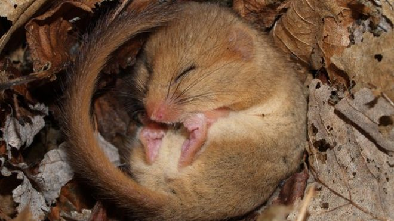

```{r setup, include=FALSE}
knitr::opts_chunk$set(echo = FALSE)
library(tidyverse)
library(magrittr)
library(ggplot2)
library(lme4)
library(spaMM)
library(car)
library(DHARMa)

source(file = here::here('data', 'Prep_data.R'))   ## consider leaving out and directly loading df.Rda

## load data on metabolic rates - in case above line does not work
# load(file = here::here('data', 'df_metab_Dormice.Rda'))
```

# Understanding effects of global warming on hibernation 

Iris Pretzlaff at Hamburg University studied hibernation of dormice with the goal of understanding how global warming will affect physiology during hibenration and how this can affect population viability

<p style="text-align:center;">

</p>


**Hypotheses**:

- The effect of temperature on metabolic rate differs among individuals in torpor and in normothermic state
    + A quadratic effect of temperature on metabolic rate of torpid individuals is expected, so that the metabolic rate is lowest during optimal temperature range and increases for too low / too high temperatures
    + No effect of temperature on metabolic rate of normothermic individuals is expected because they should be able to thermoregulate
- Probability of arousal during hibernation is related to ambient temperature and time since hibernation. For both variables a quadratic effect is expected, so that the probability of arousal is lower at the intermediate values of temperature and time since arousal and increases for low / high temperature and the beginning / end of hibernation
- Body mass is expected to decrease with high arousal frequency and high average metabolic rate one month prior to body mass measurement

# Data collection
Iris observed 12 and 13 individuals over winters of 2009 and 2011 in wooden boxes, kept outside in their natural conditions.
Skin temperature was measured with data loggers. Torpor and arousal bouts were assigned based on skin temperature:
Torpor was defined as any time when skin temperature decreased < 30°C (Tskin of active, normothermic animals is around 36°C) and an arousal when skin temperature increased > 30°C between torpor bouts, or when the difference Tskin-Tnest was > 30°C.

Metabolic rate was measured as oxygen consumption (*ml* $O_{2}$/h) using open-flow respirometry. For more details see Pretzlaff et al. (2021). 

# Analyses of metabolic rate  
## Looking at the data  

```{r histograms, echo = TRUE, fig.align='center'}
hist(df$Tamb, xlab = expression('Ambient temperature, ' ~degree~C), main = NULL)
hist(df$MR_h, xlab = expression('Metabolic rate, ml' ~O^{2}~ '/ h'), main = NULL)
hist(log(df$MR_h), 
     xlab = expression('Log metabolic rate, log(ml' ~O^{2}~ '/ h)'), main = NULL)  
hist(df$MR_h[df$state == 0], main = 'Metabolic rate in torpor', xlab = expression('Metabolic rate, ml' ~O^{2}~ '/ h'))
hist(log(df$MR_h[df$state == 0]), main = 'Metabolic rate in torpor', xlab = expression('Log Metabolic rate, log(ml' ~O^{2}~ '/ h)'))
hist(df$MR_h[df$state == 1], main = 'Metabolic rate in arousal',  xlab = expression('Metabolic rate, ml' ~O^{2}~ '/ h'))
hist(log(df$MR_h[df$state == 1]),  main = 'Metabolic rate in arousal', xlab = expression('Log Metabolic rate, log(ml' ~O^{2}~ '/ h)'))

```

# More data preparation
```{r data prep, echo = TRUE}
df$Log_MR <- log(df$MR_h)
df$Tamb2 <- df$Tamb^2
df$Y <- 2009
df$Y[df$Year %in% c(2011, 2012)] <- 2011
df$Y <- as.factor(df$Y)
df$ID <- as.factor(df$ID)
```


``` {r split per state, echo = TRUE, fig.align = 'center'}
## split into two datasets based on the state
torpor <- df[df$state == 0, ]
aroused <- df[df$state == 1, ]

nrow(torpor)   ## 13820
nrow(aroused)  ### 2765

# prevalence of arousal
nrow(aroused) / (nrow(aroused) + nrow(torpor))
hist(aroused$Month)  
xyplot(Log_MR ~ Tamb|ID, data = torpor, xlab = expression('Ambient temperature, ' ~degree~C), ylab = 'Log metabolic rate')  

xyplot(Log_MR ~ Tamb|ID, data = aroused, xlab = expression('Ambient temperature, ' ~degree~C), ylab = 'Log metabolic rate')
```

## Torpor analyses
- First fit a rather unrealistic model, linear model
``` {r  torpor lm, echo = TRUE}
# exclude missing values 
torpor <- torpor[!is.na(torpor$Log_MR),]
torpor <- torpor[!is.na(torpor$Tamb),]

## first completely unrealistic model, lm
mod0_torpor <- lm(Log_MR ~ Tamb + Tamb2 + Y, data = torpor)
summary(mod0_torpor)

```

Diagnostics of the fitted linear model.
``` {r  torpor lm diagn, echo = TRUE, fig.align = 'center'}
par(mfrow = c(2,2), mar = c(4, 4, 2, 1))
plot(mod0_torpor)

```
<span style="color:orange"> What does this diagnostics plots tell us? </span>


We should also plot residuals vs each of the predictors.     
Besides, the measurements are taken repeatedly over time, meaning there is likely temporal autocrrelaiton in residuals, so we have to check for that.   
``` {r  torpor lm more diagn, echo = TRUE, fig.align = 'center', message = FALSE}
torpor$resid_lm <- resid(mod0_torpor)
ggplot(torpor, aes(x = Tamb, y = resid_lm)) +
  geom_point() +
  geom_smooth(method = 'loess', se = FALSE) +
  theme_bw()

ggplot(torpor, aes(x = Tamb, y = resid_lm)) +
  geom_point() +
  geom_smooth(method = 'loess', se = FALSE) + 
  facet_wrap(vars(Y))  +
  theme_bw()

autocor <- acf(torpor$resid_lm)
durbinWatsonTest(mod0_torpor)
```
<span style="color:orange"> What do we conclude now? </span>     
Fine, we also started with the very simple model on purpose. It is better to go this way, to built-up complexity (while acknowledging that many assumptions are still violated in a simplified case). 

### Accounting for the non-independence in data: fit mixed-effects model with ID as random intercept
``` {r  torpor ME randI, echo = TRUE}
modRandID_torpor <- fitme(Log_MR ~ Tamb + Tamb2 + Y + (1|ID), 
                        data = torpor, method = 'REML')
summary(modRandID_torpor)
```

### Model diagnostics of the mixed-effects model with random intercept   
Let us directly use DHARMa.  

```{r moddiagn RInt, echo = TRUE, fig.align='center'}
sim <- simulateResiduals(modRandID_torpor, plot = T)  
testUniformity(sim, plot = F)
testQuantiles(sim, plot = T)

# plot residuals vs our predictors
plotResiduals(sim, form = torpor$Tamb)
plotResiduals(sim, form = torpor$Y)
```
<span style="color:orange"> How do we interpret these plots? </span>

Let us test for temporal autocorrelation, since the measurements were taken over time for each individual.     
```{r autocor RIntMod, echo = TRUE, fig.align='center'}
sim_ID10 <- recalculateResiduals(sim, sel = torpor$ID == 10)
testTemporalAutocorrelation(sim_ID10, time = torpor$Timecon[torpor$ID == '10'])

```


```{r fun testAutocor, echo = FALSE}
# a little function to perform the temp autocor test per study
fun_autocor <- function(simulatedObj, data, ID){
sim_subset <- recalculateResiduals(simulatedObj, sel = data$ID == ID)
testAut <- testTemporalAutocorrelation(sim_subset, time = data$Timecon[data$ID == ID], plot = F)
return(list(testAut, data.frame(DurbW = testAut$statistic, p = testAut$p.value, ID = ID)))  
}

```

Let us use a similar function we used in the lecture to test temporal autocorrelation for each individual in the dataset. 
```{r use fun testAutocor, echo = TRUE, fig.align='center', out.width= '60%'}
levels(torpor$ID)
fun_autocor(sim, torpor, ID = '10')

```


### Test autocorrelation in all studies

```{r testAutocor All Stud, echo = TRUE}
dat_autoc <- data.frame(DurbW =numeric(), p = numeric())
dat_autoc <- rbind(dat_autoc, fun_autocor(sim, torpor, 10)[[2]])
for(i in unique(torpor$ID)[-1]){
  dat_autoc <- rbind(dat_autoc, fun_autocor(sim, torpor, ID = i)[[2]])
}

dat_autoc$sign <- ifelse(dat_autoc$p < 0.05,'Yes','No')
sum(dat_autoc$sign == 'Yes')
length(levels(torpor$ID))  
```
So, temporal autocorrelation is still an issue here.    
We will learn how to incorporate temporal autocorrelation in mixed-effects models in the next lecture.   

# Model inference
Let us interpret the results of mixed-effects model with the random intercept (assuming that the model diagnostics were fine).    
Recall the hypothesis about the effects of temperature on metabolic rate in torpid individuals:     
 - A quadratic effect of temperature on metabolic rate of torpid individuals is expected, so that the metabolic rate is lowest during optimal temperature range and increases for too low / too high temperatures   
 
 
 
To infer anything about model parameters we have to refit the model with ML (since the inference is on fixed effects, i.e. slopes of temperature!)
``` {r  torpor ME randI ML, echo = TRUE}
modRandID_torpor_ML <- fitme(Log_MR ~ Tamb + Tamb2 + Y + (1|ID), 
                        data = torpor, method = 'ML')
summary(modRandID_torpor_ML)
```
<span style="color:orange"> Do we find support for our hypothesis? </span>

Use LRT to (formally) assess the quadratic and the linear effect of temperature on metabolic rate. 

``` {r  torpor LRT ML, echo = TRUE}
modRandID_torpor_noQuadML <- fitme(Log_MR ~ Tamb + Y + (1|ID), 
                        data = torpor, method = 'ML')
summary(modRandID_torpor_noQuadML)

modRandID_torpor_noQuadnoLinML <- fitme(Log_MR ~ Y + (1|ID), 
                        data = torpor, method = 'ML')
summary(modRandID_torpor_noQuadnoLinML)
anova(modRandID_torpor_noQuadML, modRandID_torpor_ML, boot.repl = 0)
anova(modRandID_torpor_noQuadnoLinML, modRandID_torpor_noQuadML, boot.repl = 0)
```
<span style="color:orange"> Do we find support for our hypothesis? </span>

# Questions?


