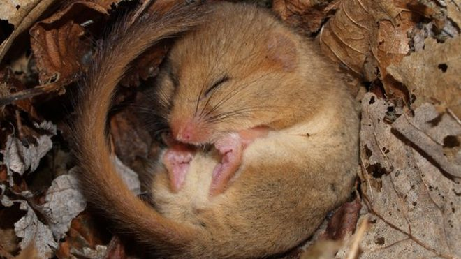

```{r setup, include=FALSE}
knitr::opts_chunk$set(echo = FALSE)
library(tidyverse)
library(ggplot2)
library(lme4)
library(spaMM)
library(DHARMa)
library(lattice)
library(glmmTMB)

source(file = here::here('data', 'Prep_data.R'))   ## consider leaving out and directly loading df.Rda

## load data on metabolic rates - in case above line does not work
# load(file = here::here('data', 'df_metab_Dormice.Rda'))
```

# Continue working with the dataset on the effects of global warming on hibernation 

Iris Pretzlaff at Hamburg University studied hibernation of dormice with the goal of understanding how global warming will affect physiology during hibernation and how this can affect population viability

<p style="text-align:center;">

</p>


**Hypotheses**:

- The effect of temperature on metabolic rate differs among individuals in torpor and in normothermic state
    + A quadratic effect of temperature on metabolic rate of torpid individuals is expected, so that the metabolic rate is lowest during optimal temperature range and increases for too low / too high temperatures
    + No effect of temperature on metabolic rate of normothermic individuals is expected because they should be able to thermoregulate
- Probability of arousal during hibernation is related to ambient temperature and time since hibernation. For both variables a quadratic effect is expected, so that the probability of arousal is lower at the intermediate values of temperature and time since arousal and increases for low / high temperature and the beginning / end of hibernation
- Body mass is expected to decrease with high arousal frequency and high average metabolic rate one month prior to body mass measurement

# Data collection
Iris observed 12 and 13 individuals over winters of 2009 and 2011 in wooden boxes, kept outside in their natural conditions.
Skin temperature was measured with data loggers. Torpor and arousal bouts were assigned based on skin temperature:
Torpor was defined as any time when skin temperature decreased < 30°C (Tskin of active, normothermic animals is around 36°C) and an arousal when skin temperature increased > 30°C between torpor bouts, or when the difference Tskin-Tnest was > 30°C.

Metabolic rate was measured as oxygen consumption (*ml* $O_{2}$/h) using open-flow respirometry. For more details see Pretzlaff et al. (2021). 

# Focus: Probability of arousal
We focus on testing the hypothesis about the probability of arousal. 

## Exploratory plots

``` {r explore arousal prob, echo = TRUE, fig.align = 'center'}
xyplot(state ~ Tamb|ID, data = df)

xyplot(state ~ HoursBegin|ID, data = df)

s2009 <- df[df$Year %in% c(2009, 2010), ]
s2011 <- df[df$Year %in% c(2011, 2012), ]

xyplot(state ~ idate | ID, data = s2009)
xyplot(state ~ idate | ID, data = s2011)
```

## More data preparation
We rescale the data for better model convergence. Feel free to try and fit the model without this step (I already did that) and see what happens. 
``` {r model arousal prob, echo = TRUE, fig.align = 'center'}
df <- df[! (is.na(df$HoursBegin) | is.na(df$Tamb)), ]
min(df$HoursBegin)

# coding year as a factor
df$Y <- 2009
df$Y[df$Year %in% c(2011, 2012)] <- 2011
df$Y <- as.factor(df$Y)

### rescaling time since hibernation and temperature for better convergence
df$HoursScale <- (df$HoursBegin - mean(df$HoursBegin, na.rm = T)) / sd(df$HoursBegin, na.rm = T)
df$HoursScale2 <- df$HoursScale^2
hist(df$HoursScale, 
     xlab = 'Standarized time since begin hibernation',
     main = NULL, col = 'black')

df$T_scale <- (df$Tamb - mean(df$Tamb, na.rm = T)) / sd(df$Tamb, na.rm = T)
df$Tscale2 <- df$T_scale ^ 2
hist(df$T_scale, xlab = 'Standardized temperature', 
     main = NULL, col ='black')
```

## Fit an unrealistic model, a GLM with Binomial distribution and logit link.
```{r Binomial Mod, echo = TRUE}
mod0_probA <- glm(state ~ HoursScale + HoursScale2 + 
                    T_scale + Tscale2 + Y, 
                  family = binomial(link = 'logit'),
                  data = df)
summary(mod0_probA)
```
<span style = 'color:orange'>Any idea how we can conduct model diagnostics for this model?</style>   

<span style = 'color:orange'>What about calculating dispersion, do you remember how we can do a quick check whether overdispersion is potentially an issue?</style>

## Fit a mixed-effect model with random intercept.
Here we assume that time since the beginning of hibernation and temperature have same effects across all individuals, but that there is some random variation among individuals in the intercept for i) time since begin of hibernation and ii) temperature for each individual. We use glmmTMB package to fit these models because we want to be able to plot the predictions in the end (+ ideally fit autocorrelation per individual)
```{r randInt Binom, echo = TRUE}
modRandID_prob <- glmmTMB(state ~ HoursScale + HoursScale2 +
                          T_scale + Tscale2 +
                          Y + (1|ID), 
                         family = binomial,
                         data=df)
summary(modRandID_prob)


```

Diagnostics of the fitted random-intercept model. Let us use DHARMa package.

``` {r randInt diagn, echo = TRUE, fig.align = 'center'}
sim <- simulateResiduals(modRandID_prob, plot = T)  
testUniformity(sim, plot = F)
testQuantiles(sim, plot = T)

testDispersion(sim)
# plot residuals vs our predictors
plotResiduals(sim, form = df$T_scale)
plotResiduals(sim, form = df$HoursScale)

```
<span style="color:orange"> What does this diagnostics plots tell us? </span>

Test for temporal autocorrelation since the measurements were taken over time.
```{r autocor RIntMod, echo = TRUE, fig.align='center'}
sim_ID10 <- recalculateResiduals(sim, sel = df$ID == 10)
testTemporalAutocorrelation(sim_ID10, time = df$Timecon[df$ID == '10'])

```


```{r fun testAutocor, echo = FALSE}
# a little function to perform the temp autocor test per study
fun_autocor <- function(simulatedObj, data, ID){
sim_subset <- recalculateResiduals(simulatedObj, sel = data$ID == ID)
testAut <- testTemporalAutocorrelation(sim_subset, time = data$Timecon[data$ID == ID], plot = F)
return(list(testAut, data.frame(DurbW = testAut$statistic, p = testAut$p.value, ID = ID)))  
}

```

Let us use a similar function we used in the lecture to test temporal autocorrelation for each individual in the dataset. 
```{r use fun testAutocor, echo = TRUE, fig.align='center', out.width= '60%'}
levels(df$ID)
fun_autocor(sim, df, ID = '10')

```


### Test autocorrelation in all studies

```{r testAutocor All Stud, echo = TRUE}
dat_autoc <- data.frame(DurbW =numeric(), p = numeric())
dat_autoc <- rbind(dat_autoc, fun_autocor(sim, df, 10)[[2]])
for(i in unique(df$ID)[-1]){
  dat_autoc <- rbind(dat_autoc, fun_autocor(sim, df, ID = i)[[2]])
}

dat_autoc$sign <- ifelse(dat_autoc$p < 0.05,'Yes','No')
sum(dat_autoc$sign == 'Yes')
length(levels(df$ID))  
```
So, autocorrelation is an issue

## Fit the Binomial model with autocorrelation
Attention: we assume we have time running continuously for each individual. But in fact, for some of them there are little gaps in the records (for temperature and metabolic rate)
```{r randInt-AR1, echo = TRUE}
df$Time_fac <- as.factor(df$Timecon)
modRandAR_prob <- glmmTMB(state ~ HoursScale + HoursScale2 +
                          T_scale + Tscale2 +
                          Y + (1|ID) +  ar1(Time_fac - 1|ID), 
                         family = binomial,
                         data=df)
summary(modRandAR_prob)

```
<span style = "color:orange">How do you interpret these results? What do you think about this model compared to the one without autocorrelation?</span>

# Model diagnostics for the model with autocorrelation

``` {r randInt AR1 diagn, echo = TRUE, fig.align = 'center'}
simAR1 <- simulateResiduals(modRandAR_prob, plot = T)  
testUniformity(simAR1, plot = F)
testQuantiles(simAR1, plot = T)

testDispersion(simAR1)

# plot residuals vs our predictors
plotResiduals(simAR1, form = df$T_scale)
plotResiduals(simAR1, form = df$HoursScale)

```


- <span style = 'color:orange'>What are main issues with model diagnostics? What can be done to fit a model that would match the data structure better?</span>

- <span style = "color:orange">We have fitted the models assuming the slopes are exactly the same across individuals and only intercepts differ. How realistic is that? Should we have tried a different random structure?</span>


From the note on DHARMa documentation:

<span style = 'color:green'>Standard DHARMa simulations from models with (temporal / spatial / phylogenetic) conditional autoregressive terms will still have the respective temporal / spatial / phylogenetic correlation in the DHARMa residuals, unless the package you are using is modelling the autoregressive terms as explicit REs and is able to simulate conditional on the fitted REs. This has two consequences:
1. If you check the residuals for such a model, they will still show significant autocorrelation, even if the model fully accounts for this structure.
2. Because the DHARMa residuals for such a model are not statistically independent any more, other tests (e.g. dispersion, uniformity) may have inflated type I error, i.e. you will have a higher likelihood of spurious residual problems.</span>

<span style = 'color:red'> Attention! This is very slow and takes long time to run. I suggest you run it after the session </span>
```{r diagn_rotateResid, echo = TRUE, eval = FALSE}
##DO not run
simAR1_rot <- simulateResiduals(modRandAR_prob, plot = T, rotation = 'estimated')
testUniformity(simAR1_rot, plot = F)
testQuantiles(simAR1_rot, plot = T)

testDispersion(simAR1_rot)

# plot residuals vs our predictors
plotResiduals(simAR1_rot, form = df$T_scale)
plotResiduals(simAR1_rot, form = df$HoursScale)
```
Conclusion: know what function is doing exactly. Do not just copy-paste the codes!

# Model inference 
To test the hypothesis that both temperature and time have a quadratic effect on probability of arousal, we fit the models without each quadratic term in turn, and run LRTs.

```{r noQuad, echo = TRUE}
modRandAR_no2T_prob <- glmmTMB(state ~ HoursScale + HoursScale2 +
                          T_scale + 
                          Y + (1 | ID) +  ar1(Time_fac - 1|ID), 
                         family = binomial,
                         data=df)
modRandAR_no2Hour_prob <- glmmTMB(state ~ HoursScale + 
                          T_scale + Tscale2 +
                          Y + (1 | ID) +  ar1(Time_fac - 1|ID), 
                         family = binomial,
                         data=df)

anova(modRandAR_prob, modRandAR_no2T_prob)  ## significant quadratic effect
```
<span style = 'color:orange'>Note we have 'Warning about false convergence' for the model without the quadratic effect of time. Inspect its output and think what are the possible causes and what can be done?</span>

```{r insepct Modno Time, echo = TRUE}
summary(modRandAR_no2Hour_prob)

```


# Plot predictions
Prepare a new data frame. First predict on the scale of the linear predictor.
```{r newdPredictions, echo = TRUE, fig.align='center'}
min(df$T_scale)
min(df$HoursScale)
new_dat <- expand.grid('ID' = unique(df$ID), 
                       'Y' = unique(df$Y),
                       T_scale = seq(from = min(df$T_scale), to = 
                                    max(df$T_scale), length.out = 20),
                       HoursScale = seq(from = min(df$HoursScale), to = 
                                    max(df$HoursScale), length.out = 20))

new_dat$HoursScale2 <- new_dat$HoursScale^2
new_dat$Tscale2 <- new_dat$T_scale^2
head(new_dat)

new_dat$Time_fac <- as.factor(rep('1', nrow(new_dat)))  ## keeping just to one time point, to avoid variaiton here
new_dat$pred_fixTMB <- predict(modRandAR_prob, newdata = new_dat, re.form = NA, type = 'link')

new_dat <- new_dat[order(new_dat$ID, new_dat$Y, new_dat$T_scale), ]
ggplot(data = new_dat, aes(x = T_scale, y = pred_fixTMB, group = as.factor(HoursScale), col = as.factor(HoursScale))) +
  geom_point() + theme_bw() +
  facet_grid(cols = vars(Y)) +
  xlab('Standardized temperature') + ylab('Linear predictor')

```

```{r plotPred-Hours, echo = TRUE, fig.align='center'}
ggplot(data = new_dat, aes(x = HoursScale, y = pred_fixTMB, group = as.factor(HoursScale), col = as.factor(T_scale))) +
  geom_point() + theme_bw() +
  facet_grid(cols = vars(Y)) +
  xlab('Standardized time sing begin of hibernation') + ylab('Linear predictor')

```

What is the probability to arouse close to the end of hibernation
```{r pred-response, echo = TRUE, fig.align='center'}
max(df$HoursScale)
new_dat <- expand.grid('ID' = unique(df$ID), 
                       'Y' = unique(df$Y),
                       T_scale = seq(from = min(df$T_scale), to = 
                                    max(df$T_scale), length.out = 20),
                       HoursScale = 1.6)  ## set time to median, to avoid additional variaiton

new_dat$HoursScale2 <- new_dat$HoursScale^2
new_dat$Tscale2 <- new_dat$T_scale^2
head(new_dat)

new_dat$Time_fac <- as.factor(rep('1', nrow(new_dat)))  ## keeping just to one time point, to avoid variaiton here
new_dat$pred_fixTMB <- predict(modRandAR_prob, newdata = new_dat, re.form = NA, type = 'response')

ggplot(data = new_dat, aes(x = T_scale, y = pred_fixTMB)) +
  geom_line() + theme_bw() +
  facet_grid(cols = vars(Y)) +
  xlab('Standardized temperature') + ylab('Probability of arousal')

```

Add CI to the prediction on probability to arouse from hibernation
```{r CI, echo = TRUE, fig.align='center'}
new_dat$pred_fixTMB <- predict(modRandAR_prob, newdata = new_dat, re.form = NA, type = 'response')
new_dat$pre_SE_fixTMB <- predict(modRandAR_prob, newdata = new_dat, re.form = NA, se.fit = TRUE, type = 'response')$se.fit 
new_dat$pred_upper_fix <- new_dat$pred_fixTMB + qnorm(0.975)*new_dat$pre_SE_fixTMB 
new_dat$pred_lower_fix <- new_dat$pred_fixTMB - qnorm(0.975)*new_dat$pre_SE_fixTMB 
head(new_dat)

# predictions for the mean response across species
ggplot(data = new_dat, aes(x = T_scale, y = pred_fixTMB)) +
  theme_bw() + facet_grid(cols = vars(Y)) +
  geom_ribbon(data = new_dat, aes(x = T_scale, ymin = pred_lower_fix, ymax = pred_upper_fix), alpha = 0.1) +
  geom_line(lty  = 3) +
    xlab('Standardized temperature') + ylab('Probability of arousal')

  
```
Attention: we only used predictions with the fixed part of the model, not including random effects at all!


Repetition: how do you go from the scale of the response to the linear predictor?
```{r repetition, echo = TRUE}
new_dat$pred_fixTMB_link <- predict(modRandAR_prob, newdata = new_dat, re.form = NA, type = 'link')
new_dat$pred_trans <- exp(new_dat$pred_fixTMB_link)/(1 + exp(new_dat$pred_fixTMB_link))

ggplot(data = new_dat, aes(x = T_scale, y = pred_trans)) +
  geom_line() + theme_bw() +
  facet_grid(cols = vars(Y)) +
  xlab('Standardized temperature') + ylab('Probability of arousal')

```


# Questions?


